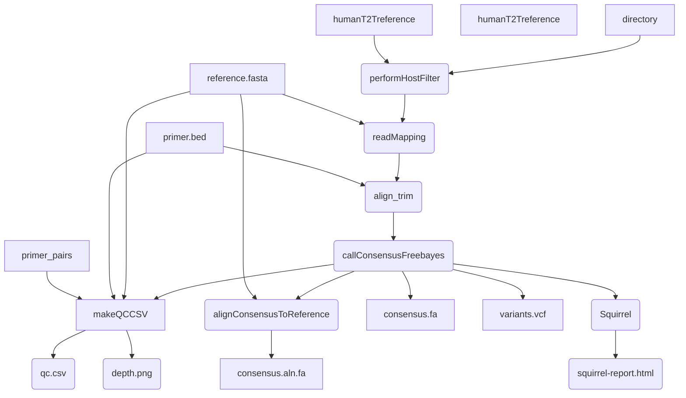

# artic-mpxv-illumina-nf
A Nextflow pipeline for processing amplicon data generated by Illumina sequencing, with a focus on monkeypox virus (mpxv).

#### Introduction

This pipeline is based on the [BCCDC-PHL/ncov2019-artic-nf](https://github.com/BCCDC-PHL/ncov2019-artic-nf) pipeline, which is a fork of the [connor-lab/ncov2019-artic-nf](https://github.com/connor-lab/ncov2019-artic-nf) pipeline. It has been modified to support analysis of MPox virus.



#### Quick-start

```
nextflow run artic-network/artic-mpxv-illumina-nf --help
```

Will print up-to-date information on all command-line parameters for the current version.

# Credits / Acknowledgements
This pipeline only works due to the ongoing efforts of many people performing the often thankless
job of developing and maintaining bioinformatics software, including but not limited to:

* Bwa - Heng Li, et al, citation: `Li H. (2013) Aligning sequence reads, clone sequences and assembly contigs with BWA-MEM. arXiv:1303.3997v2 [q-bio.GN]. (if you use the BWA-MEM algorithm or the fastmap command, or want to cite the whole BWA package)`
* Samtools - Heng Li et al, citation: `Petr Danecek, James K Bonfield, Jennifer Liddle, John Marshall, Valeriu Ohan, Martin O Pollard, Andrew Whitwham, Thomas Keane, Shane A McCarthy, Robert M Davies, Heng Li. GigaScience, Volume 10, Issue 2, February 2021, giab008, https://doi.org/10.1093/gigascience/giab008`
* Bcftools - Heng Li et al, citation: `Petr Danecek, James K Bonfield, Jennifer Liddle, John Marshall, Valeriu Ohan, Martin O Pollard, Andrew Whitwham, Thomas Keane, Shane A McCarthy, Robert M Davies, Heng Li. GigaScience, Volume 10, Issue 2, February 2021, giab008, https://doi.org/10.1093/gigascience/giab008`
* Hostile - Bede Constantinides et al, citation: `Bede Constantinides, Martin Hunt, Derrick W Crook, Hostile: accurate decontamination of microbial host sequences, Bioinformatics, 2023; btad728, https://doi.org/10.1093/bioinformatics/btad728`
* BBMap - Bushnell B. - `sourceforge.net/projects/bbmap/`
* trim_galore - Felix Krueger et al, `https://github.com/FelixKrueger/TrimGalore`
* ivar - Nathan Grubaugh et al, citation: `Grubaugh, N.D., Gangavarapu, K., Quick, J. et al. An amplicon-based sequencing framework for accurately measuring intrahost virus diversity using PrimalSeq and iVar. Genome Biol 20, 8 (2019). https://doi.org/10.1186/s13059-018-1618-7`
* Freebayes - Erik Garrison et al, citation: `Garrison E, Marth G. Haplotype-based variant detection from short-read sequencing. arXiv preprint arXiv:1207.3907 [q-bio.GN] 2012`
* MAFFT - Kazutakah Katoh et al, citation: `Katoh K, Standley DM. MAFFT multiple sequence alignment software version 7: improvements in performance and usability. Mol Biol Evol. 2013 Apr;30(4):772-80. doi: 10.1093/molbev/mst010. Epub 2013 Jan 16. PMID: 23329690; PMCID: PMC3603318.`
  
Special thanks to the following for writing / modifying / maintaining previous versions of this pipeline:
* Matt Bull et al, `https://github.com/connor-lab/ncov2019-artic-nf`
* Jared Simpson, `https://github.com/jts/ncov2019-artic-nf`
* Dan Fornika et al, `https://github.com/BCCDC-PHL/mpxv-artic-nf`

### Problems and Solutions

1. Error during `mpxvIllumina:prepareReferenceFiles:performHostFilter` step
  ```
  httpx.HTTPError: Failed to download https://objectstorage.uk-london-1.oraclecloud.com/n/lrbvkel2wjot/b/human-genome-bucket/o/human-t2t-hla.tar. Ensure you are connected to the internet, or provide a valid path to a local index
  ```

  Currently human read removal is performed with hostile, which downloads an indexed human genome file on the fly. This is almost certainly a network connectivity problem.

