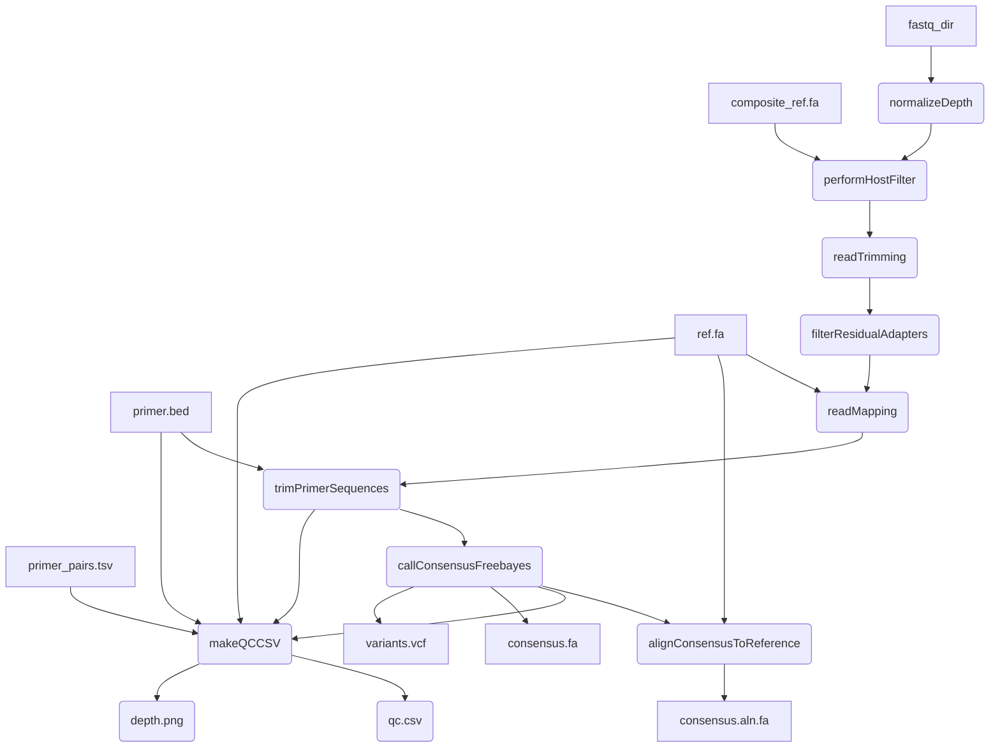

# artic-mpxv-illumina-nf
A Nextflow pipeline for processing amplicon data generated by Illumina sequencing, with a focus on monkeypox virus (mpxv).


#### Introduction

This pipeline is based on the [BCCDC-PHL/ncov2019-artic-nf](https://github.com/BCCDC-PHL/ncov2019-artic-nf) pipeline, which is a fork of the [connor-lab/ncov2019-artic-nf](https://github.com/connor-lab/ncov2019-artic-nf) pipeline. It has been modified to support analysis of monkeypox virus.



#### Quick-start

```
nextflow run BCCDC-PHL/mpxv-artic-nf -profile conda \
  --prefix "output_file_prefix" \
  --bed /path/to/primers.bed \
  --ref /path/to/ref.fa \
  --primer_pairs_tsv /path/to/primer_pairs_tsv \
  --composite_ref /path/to/human_and_mpxv_composite_ref \
  --directory /path/to/reads \
  --outdir /path/to/outputs
```

# Credits / Acknowledgements
This pipeline only works due to the ongoing efforts of many people performing the often thankless
job of developing and maintaining bioinformatics software, including but not limited to:

* Bwa - Heng Li, et al, citation: `Li H. (2013) Aligning sequence reads, clone sequences and assembly contigs with BWA-MEM. arXiv:1303.3997v2 [q-bio.GN]. (if you use the BWA-MEM algorithm or the fastmap command, or want to cite the whole BWA package)`
* Samtools - Heng Li et al, citation: `Petr Danecek, James K Bonfield, Jennifer Liddle, John Marshall, Valeriu Ohan, Martin O Pollard, Andrew Whitwham, Thomas Keane, Shane A McCarthy, Robert M Davies, Heng Li. GigaScience, Volume 10, Issue 2, February 2021, giab008, https://doi.org/10.1093/gigascience/giab008`
* Bcftools - Heng Li et al, citation: `Petr Danecek, James K Bonfield, Jennifer Liddle, John Marshall, Valeriu Ohan, Martin O Pollard, Andrew Whitwham, Thomas Keane, Shane A McCarthy, Robert M Davies, Heng Li. GigaScience, Volume 10, Issue 2, February 2021, giab008, https://doi.org/10.1093/gigascience/giab008`
* Hostile - Bede Constantinides et al, citation: `Bede Constantinides, Martin Hunt, Derrick W Crook, Hostile: accurate decontamination of microbial host sequences, Bioinformatics, 2023; btad728, https://doi.org/10.1093/bioinformatics/btad728`
* BBMap - Bushnell B. - `sourceforge.net/projects/bbmap/`
* trim_galore - Felix Krueger et al, `https://github.com/FelixKrueger/TrimGalore`
* ivar - Nathan Grubaugh et al, citation: `Grubaugh, N.D., Gangavarapu, K., Quick, J. et al. An amplicon-based sequencing framework for accurately measuring intrahost virus diversity using PrimalSeq and iVar. Genome Biol 20, 8 (2019). https://doi.org/10.1186/s13059-018-1618-7`
* Freebayes - Erik Garrison et al, citation: `Garrison E, Marth G. Haplotype-based variant detection from short-read sequencing. arXiv preprint arXiv:1207.3907 [q-bio.GN] 2012`
* MAFFT - Kazutakah Katoh et al, citation: `Katoh K, Standley DM. MAFFT multiple sequence alignment software version 7: improvements in performance and usability. Mol Biol Evol. 2013 Apr;30(4):772-80. doi: 10.1093/molbev/mst010. Epub 2013 Jan 16. PMID: 23329690; PMCID: PMC3603318.`
  
Special thanks to the following for writing / modifying / maintaining previous versions of this pipeline:
* Matt Bull et al, `https://github.com/connor-lab/ncov2019-artic-nf`
* Jared Simpson, `https://github.com/jts/ncov2019-artic-nf`
* Dan Fornika et al, `https://github.com/BCCDC-PHL/mpxv-artic-nf`

#### Installation
An up-to-date version of Nextflow is required because the pipeline is written in DSL2. Following the instructions at https://www.nextflow.io/ to download and install Nextflow should get you a recent-enough version. 


#### Conda
The repo contains a environment.yml files which automatically build the correct conda env if `-profile conda` is specifed in the command. Although you'll need `conda` installed, this is probably the easiest way to run this pipeline.

--cache /some/dir can be specified to have a fixed, shared location to store the conda build for use by multiple runs of the workflow.

#### Config

Important config options are:

| Option                           | Default  | Description                                                                                                         |
|:---------------------------------|---------:|--------------------------------------------------------------------------------------------------------------------:|
| `normalizationTargetDepth`       | `200`    | Target depth of coverage to normalize to prior to alignment                                                         |
| `normalizationMinDepth`          | `5`      | Minimum depth of coverage to normalize to prior to alignment                                                        |
| `keepLen`                        | `50`     | Length of reads to keep after primer trimming                                                                       |
| `qualThreshold`                  | `20`     | Sliding window quality threshold for keeping reads after primer trimming                                            |
| `varMinFreqThreshold`            | `0.25`   | Allele frequency threshold for ambiguous variant                                                                    |
| `varFreqThreshold`               | `0.75`   | Allele frequency threshold for unambiguous variant                                                                  |
| `varMinDepth`                    | `10`     | Minimum coverage depth to call variant                                                                              |

### Depth Normalization
By default, sequence depth will be normalized using `bbnorm` to the value specified by the `--normalizationTargetDepth` param (default: 200). To skip depth normalization, add the `--skip_normalize_depth` flag.

#### QC
A script to do some basic QC is provided in `bin/qc.py`. It measures the % of reference bases are covered by `varMinDepth`, and the longest stretch of consensus sequence with no `N` bases. This script does not make a QC pass/fail call.

#### Output
A subdirectory for each process in the workflow is created in `--outdir`. A `nml_upload` subdirectory containing dehosted fastq files and consensus sequences is included. 

### Problems and Solutions

1. Error during `mpxvIllumina:prepareReferenceFiles:get_bed_ref` step
  ```
  httpx.HTTPError: Failed to download https://objectstorage.uk-london-1.oraclecloud.com/n/lrbvkel2wjot/b/human-genome-bucket/o/human-t2t-hla.tar. Ensure you are connected to the internet, or provide a valid path to a local index
  ```

  Currently human read removal is performed with hostile, which downloads an indexed human genome file on the fly. This is an internet problem.

